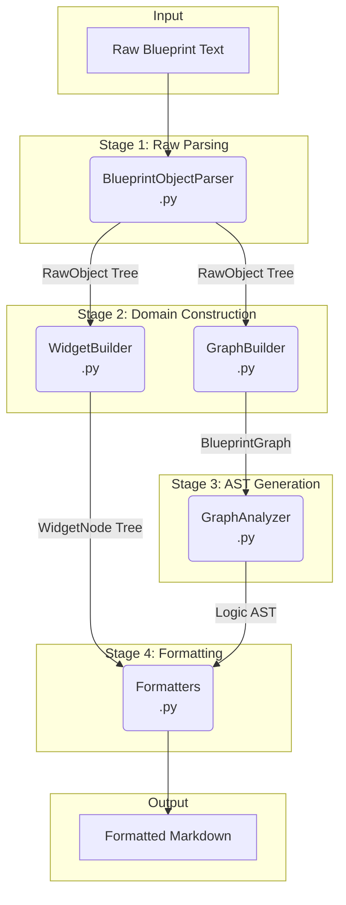

# UE5 Blueprint Parser: Architecture Guide

This document outlines the architectural principles for the UE5 Blueprint Parser, a robust, extensible, and high-fidelity system for converting `.uasset` blueprint text into human-readable, logical pseudo-code.

## Guiding Philosophy: Fidelity First

The parser's core philosophy prioritizes **high fidelity** over semantic interpretation. Its primary responsibility is to be a "recorder" that accurately mirrors the structure and information present in the source blueprint, not an "interpreter" that beautifies or transforms the logic.

This means:
- **No Automatic Simplification**: Low-level function calls are preserved (e.g., `Not_PreBool(EqualEqual_ObjectObject(...))` is not converted to `!=`).
- **No Automatic Expansion**: Macros are represented as macro calls, not expanded inline.
- **Optional Transformations**: Any "beautification" or logic expansion is delegated to optional, post-processing passes, keeping the core parser pure.

## Core Architecture: A Multi-Stage Pipeline

The parser operates as a multi-stage pipeline, inspired by modern compiler design. It processes logic (`EventGraph`) and UI (`Widget`) blueprints through distinct, specialized paths.



### Stage 1: Raw Text Parsing
- **Module**: `parser/common/object_parser.py`
- **Responsibility**: The `BlueprintObjectParser` performs a lossless conversion of the raw text into a foundational tree of `RawObject` instances. This is the universal entry point for all blueprint types.

### Stage 2: Domain-Specific Graph/Tree Construction
- **EventGraph Path**:
    - **Module**: `parser/graph_parser.py`
    - **Responsibility**: The `GraphBuilder` takes the `RawObject` tree and constructs a `BlueprintGraph`. This graph contains all nodes, pins, and their explicit connections, representing the physical structure without logical interpretation.
- **UI Widget Path**:
    - **Module**: `parser/widget_parser.py`
    - **Responsibility**: The `WidgetBuilder` takes the `RawObject` tree and constructs a clean `WidgetNode` tree. It resolves parent-child relationships using `Slot` objects to build the UI hierarchy.

### Stage 3: High-Fidelity AST Generation (EventGraph Only)
- **Modules**: `parser/analyzer.py`, `parser/processors.py`, `parser/scope_manager.py`
- **Responsibility**: This is the heart of the parser. The `GraphAnalyzer` traverses the `BlueprintGraph`, dispatching each `GraphNode` to a specialized handler in `processors.py` to produce an Abstract Syntax Tree (AST) that is a direct logical equivalent of the blueprint's structure.

#### Key Architectural Features:

1.  **Execution-Flow-Driven Traversal**:
    *   The `GraphAnalyzer` strictly follows execution pins (`exec`) from entry points (e.g., Event nodes), ensuring the resulting AST's control flow perfectly matches the blueprint's execution order.

2.  **Three-Tier Processing Strategy for Robustness**:
    *   The parser employs a **three-tier processing strategy** to ensure every node is handled gracefully, eliminating all "Unsupported node" errors:
        *   **Specialized Processors**: For nodes with unique logic (e.g., `K2Node_IfThenElse`). This includes specific handling for event binding nodes (`K2Node_AddDelegate`, `K2Node_AssignDelegate`) which are now unified into `EventSubscriptionNode`s, and the **"Inject-and-Delegate"** pattern for complex nodes like `K2Node_LatentAbilityCall`.
        *   **Generic Callable Processor**: A single, intelligent processor handles the vast majority of "function-call-like" nodes (e.g., `K2Node_CallFunction`, `K2Node_SpawnActorFromClass`).
        *   **Fallback Processor**: For any truly unknown node type, a `FallbackNode` is generated in the AST, ensuring the parsing process never halts.

3.  **Lexical Scope Manager for Precise Data Flow (`parser/scope_manager.py`)**:
    *   The `ScopeManager` manages variable visibility and lifetime within nested scopes (like loops). Nodes that output data (e.g., `ForEachLoop`'s item/index) register these outputs into the current scope.
    *   This guarantees accurate data flow resolution for downstream nodes, **permanently eradicating "UnknownExpression" errors**.

### Stage 4: AST/Tree Rendering
- **Module**: `parser/formatters/` (Package)
- **Responsibility**: This stage acts as a "printer" that traverses the generated data structure (AST or Widget tree) and renders it into a human-readable format.
    - `graph_formatter.py`: Renders the logic AST into Markdown pseudo-code.
    - `widget_formatter.py`: Renders the UI `WidgetNode` tree into a hierarchical list.

## Testing and Snapshot Workflow

To ensure consistency and ease of development, the testing workflow is streamlined:

1.  **Manual Snapshot Generation**: When blueprint parsing logic changes, run `tests/generate_snapshots.py` to update the expected outputs.
    ```bash
    .venv/Scripts/python tests/generate_snapshots.py
    ```

2.  **Automated Snapshot Consistency Test**: Run `pytest` on `tests/test_snapshots.py` to verify that the current parser output matches the existing snapshots.
    ```bash
    .venv/Scripts/python -m pytest tests/test_snapshots.py
    ```
